WindowsでGitを利用するにはGit for Windowsというソフトを利用します。

しかし、インストール時のオプションがかなり多くてセットアップするたびに戸惑うので備忘録がてらインストール手順を残しておきます。

2026年8月時点での手順です。

## エディターをインストールしておく

途中でGitの操作中にテキスト編集が必要になった際に起動するエディターを選択する画面が出てきます。

インストールしておかないと選択できないので希望するエディターがあるならインストールしておきましょう。

ちなみに以下のようなエディターが選択できます。

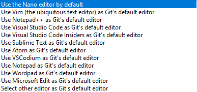

最悪選択肢になくてもコマンドラインを手動入力すれば使えるみたいです。

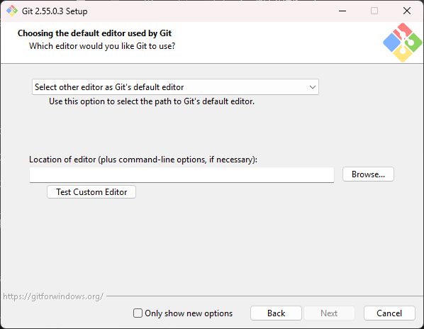

## インストーラーをダウンロード

### UniGetUIを利用する

UniGetUIを利用すれば手っ取り早く安全に(WinGetが侵害されていない限りは)インストーラーを入手することができます。

1. 検索モードを`完全一致`に設定
2. <code data-copy="Git.Git">Git.Git</code>と検索
3. 右クリック
4. `インストーラーをダウンロード`をクリック
5. 保存先ダイアログが開くのでお好きな場所に保存

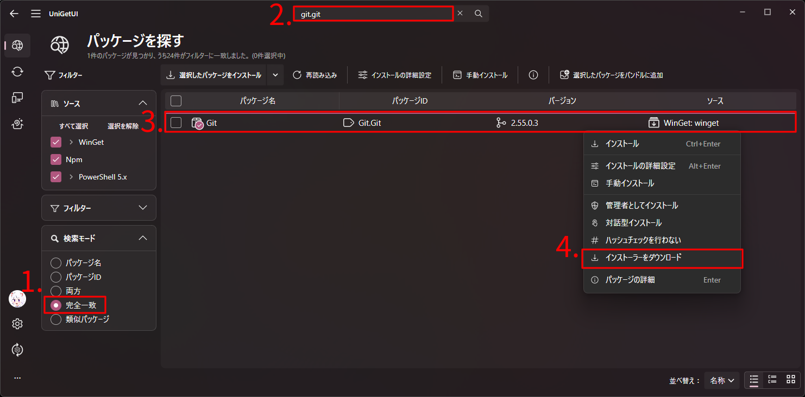

### 公式サイトを利用する

<code data-copy="Git for Windows">Git for Windows</code>
と検索して[公式サイト](https://gitforwindows.org/)にアクセスして`Download`ボタンをクリックします。

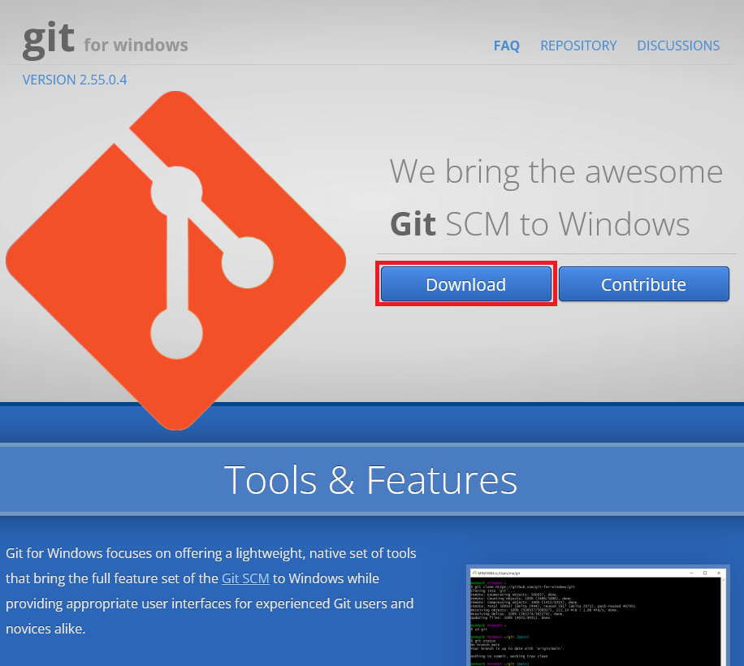

公式GitHubリポジトリの[リリースページ](https://github.com/git-for-windows/git/releases/latest)が開くので、`Git-[バージョン]-64-bit.exe`(~~そんな人いないと思うけども~~ARMをお使いなら`Git-[バージョン]-arm64.exe`)をダウンロードします。

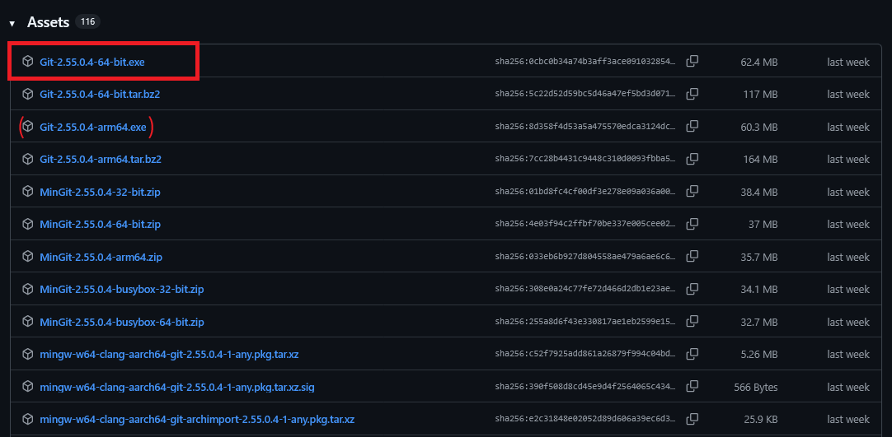

## インストール手順

### ライセンスに同意

ダウンロードしたインストーラーを開きます。

UACが出てきたら、公式のインストーラーであることを確認して許可してください。

実行できたらGPL-v2ライセンスが表示されるので`Next`をクリックして同意しましょう。

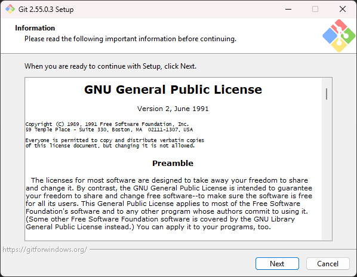

### インストール先

デフォルトで問題ないです。変えたかったら変えましょう。

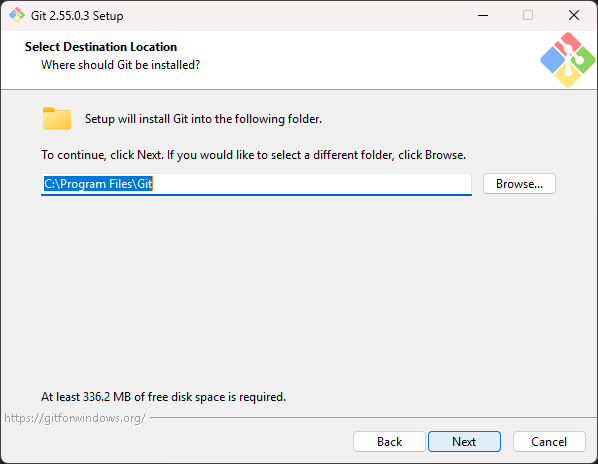

`Next`をクリックして先に進みます。

### 追加コンポーネント

お好みでどうぞ。

個人的にはデフォルトに加えて`Add a Git Bash Profile to Windows Terminal`を追加で選択しています。

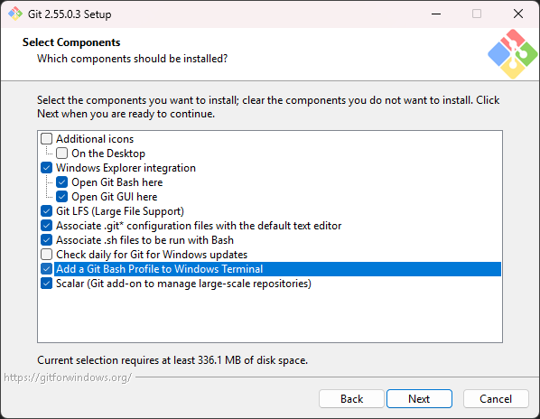

#### 追加コンポーネント一覧

- Additional icons
  - On the Desktop  
    デスクトップ上にアイコンを作成します。
- Windows Explorer integration
  - Open Git Bash here
  - Open Git GUI here  
    Git BashやGit GUIを選択したフォルダや現在のフォルダをカレントディレクトリにして開く項目をコンテキストメニューに追加します。
- Git LFS (Large File Support)  
  [Git LFS](https://git-lfs.com/)(Gitでサイズの大きいファイルを扱いやすくする機能)を有効にします。
- Associate .git\* configuration files with the default text editor  
  `.gitconfig`といったGit関連の設定ファイルをデフォルトのエディター（後で設定）に関連付けます。
- Associate .sh files to be run with Bash  
  `.sh`ファイルをGit Bashに関連付けます。
- Check daily for Git for Windows updates  
  Git for Windowsの更新があった際に通知が来ます。  
  UniGetUIを利用している場合はUniGetUI側で通知が来るのでそちらのほうが便利だったりはします。
- Add a Git Bash Profile to Windows Terminal  
  WindowsターミナルにGit Bashのプロファイルを追加します。
- Scalar (Git add-on to manage large-scale repositories)  
  [Scalar](https://git-scm.com/docs/scalar)という規模の大きいリポジトリを快適に扱えるようにするアドオンを追加します。

### スタートメニューフォルダ

スタートメニューのどのフォルダに追加するか聞かれます。デフォルトで問題ないです。  
登録したくない人は画面下の`Don't create a Start Menu folder`にチェックを入れましょう。

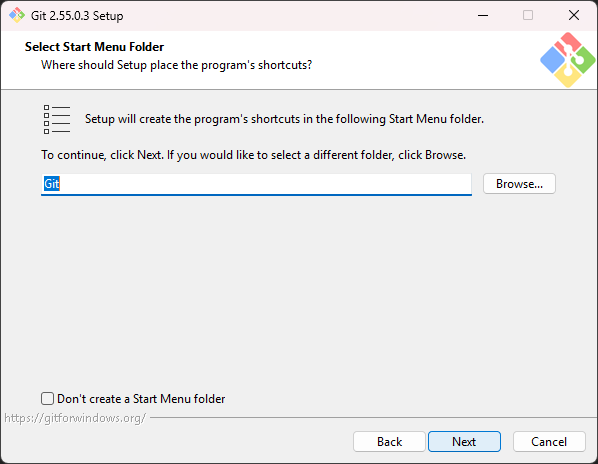

### Gitで使用するエディター

Gitのコマンド利用時にテキスト編集が必要になった際に使用するエディターを選択します。

これはお好きなものを選べばいいです。使い慣れているものに変更しておくとよいでしょう。

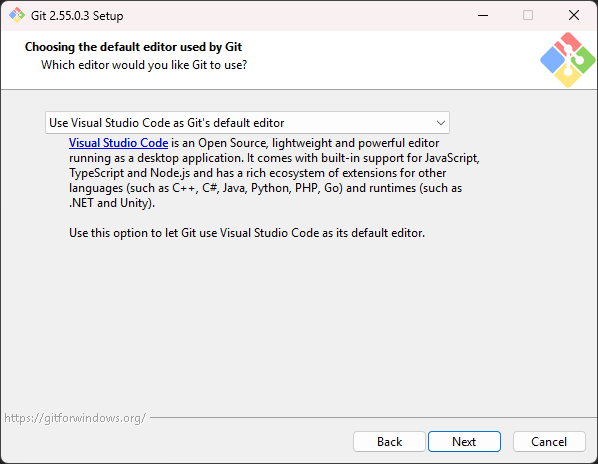

### リポジトリ初期化時のデフォルトブランチ名

2023年ごろには既にこのオプションがあったと思うのですが、なぜか永遠にデフォルトが`master`のままです。

`master`という単語が黒人差別を連想させるということから`main`へと見直しが進んでいます。

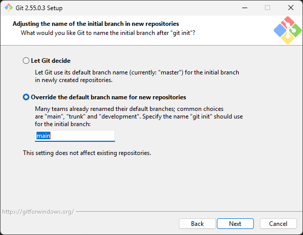

現在GitHubではデフォルトブランチ名が`main`に変更されているので、**`main`へ変更しておくことを推奨します。**

### PATHの設定

PATHにGitやUNIXのコマンドを通すかの設定です。

Recommendedとあるとおり、デフォルトで進めてください。

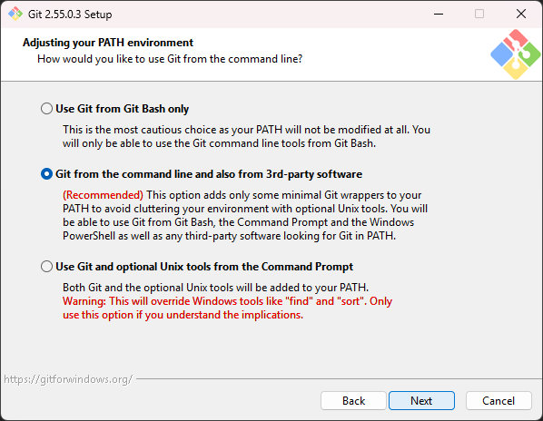

#### オプション一覧

- Use Git from Git Bash only  
  インストールされるGit BashでのみGitコマンドを利用できるようにします。
- Git from the command line and also from 3rd-party software  
  PATHにGitのコマンド類を通すことで外部のコマンドラインなどのソフトウェアからGitを利用できるようにします。
- Use Git and optional Unix tools from the Command Prompt  
  PATHにGit及び**UNIX**のコマンド類を追加します。  
  WindowsのコマンドにはUNIXのコマンドと名前が重複するものがあり、それらがUNIXのもので上書きされます。  
  そういった影響が理解している人は選んでもいいですが、正直おすすめしません。

### HTTPS接続を行うライブラリ

OpenSSLかWindows標準かどちらを使うか選択します。

デフォルトは`Use the native Windows Secure Channel library`になっていますが、**個人利用であれば`Use the OpenSSL library`に変更しておきましょう。**

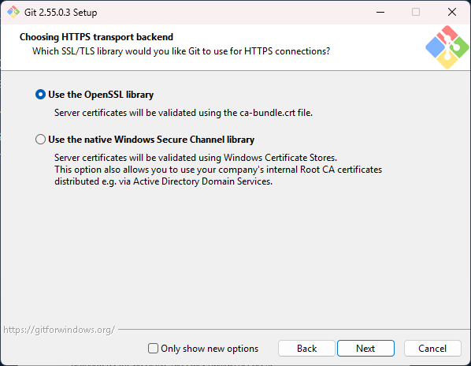

### 改行コードの自動変換

チェックアウト時やコミット時に自動で改行コードを変換するかの設定です。

自動で変換されるとトラブルが発生する恐れがあるそうなので、**自動変換は無効にしておくことを推奨します。**

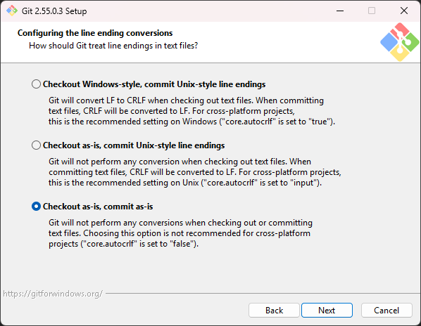

- Checkout Windows-style, commit Unix-style line endings  
  チェックアウト時にCRLF(Windowsで使用される改行コード)へ変換し、コミット時にLF(macOSやLinuxで使用される改行コード)へ変換します
- Checkout as-is, commit Unix-style line endings  
  チェックアウト時には変換を行わず、コミット時にLF(macOSやLinuxで使用される改行コード)へ変換します
- Checkout as-is, commit as-is  
  チェックアウト時にコミット時にも変換を行いません

### ターミナルエミュレーターの選択

Git Bashで利用するターミナルエミュレーターを選択します。デフォルトで進めて大丈夫です。

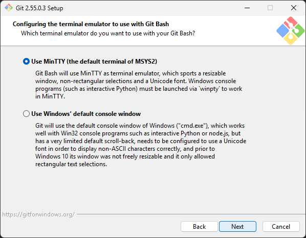

### `git pull`のデフォルト動作の選択

`git pull`を実行した際にfast-forwardに失敗した際のデフォルト動作を選択します。

最近は`Rebase`をデフォルト動作にすることが多いようです。

ただし、`Rebase`を選んだ際は共同作業時に`main`等の共用ブランチに対してRebaseを行わないように気を付ける必要があります。


分かりにくいと思うので図を使って説明します。

現在以下のような状態にあるとします。

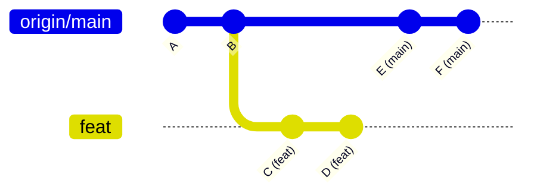

`feat`ブランチで作業中に`origin/main`ブランチにコミットがされたという状態です。

`feat`ブランチに以下のコマンドで`main`から変更を取り込こもうとします。

```bash frame="none"
git pull origin main
```

#### Merge

マージコミットを作成して`origin/main`にあるコミットを取り込みます。

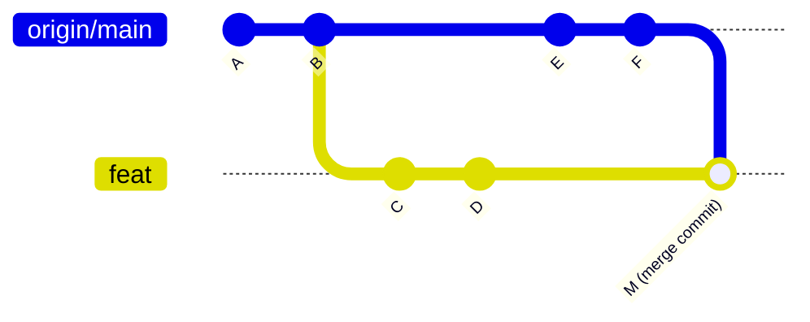

#### Rebase

自分のコミットが`origin/main`の先頭に付け直されます。  
この際、`feat`ブランチで行っていた元のコミットのハッシュは変更されます。  
(`C`->`C’`, `D`->`D’`)

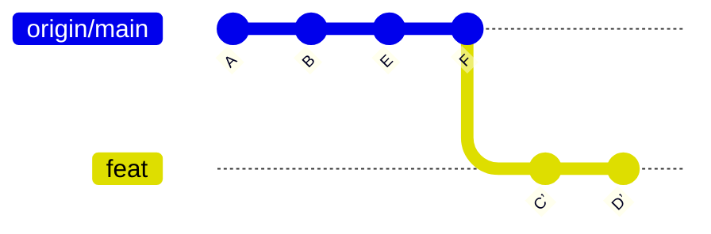

#### Fast-forward only

Fast-forwardのみで`git pull`を試行しFast-forwardが行えない場合はエラーを吐くようにします。

エラーが出た場合は明示的に`--no-rebase`でMergeするか、`--rebase`でRebaseをするか選ぶ必要があります。

### 資格情報マネージャーを選択

`Git Credential Manager`を利用することでGitHub等のリモートリポジトリへの接続時に毎回視覚情報を入力する手間を省けます。

デフォルトのまま進めましょう。

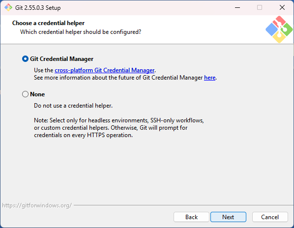

### 追加のオプション

追加のオプションを選択します。デフォルトのままで構いません。

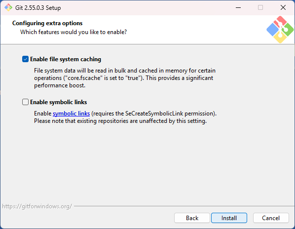

- Enable file system caching  
  ファイルシステムのデータをメモリ上にキャッシュすることでGitの動作を高速化します。ただしメモリ消費量は増えます。
- Enable symbolic links  
  シンボリックリンクと呼ばれる別の場所にあるファイルやフォルダへの参照を行う特殊なファイルへの対応を有効にします。  
  Windowsで有効にするには少し設定が必要です。無効にしている場合は参照先が記入されたただのテキストファイルとして扱われます。

### インストール開始！

ここまでお疲れ様です。`Install`を押すとインストールが開始されるので少し待ちましょう。

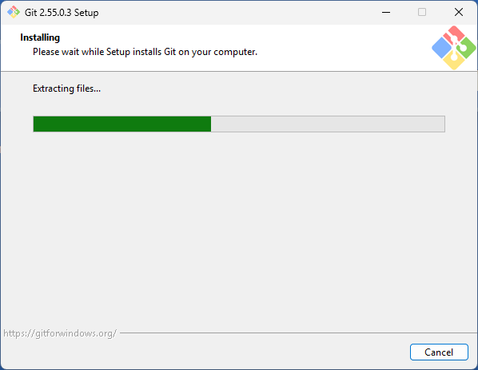

### インストール後

インストール後は以下のような画面が表示されます。

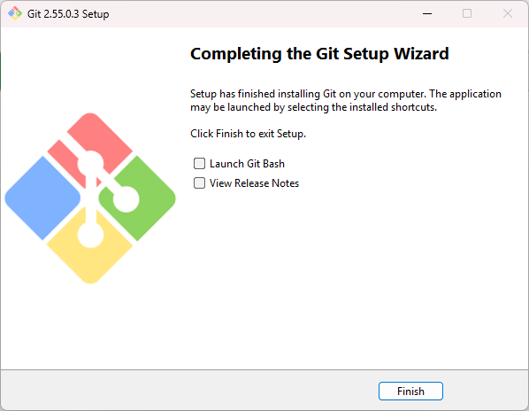

- Launch Git Bash: Git Bashを起動
- View Release Notes: リリースノートを表示

デフォルトでは`View Release Notes`にチェックが入っているので読まなくていいという人は外してから`Finish`をクリックすると閉じる手間が省けます。

まあ入れたまま終了してもブラウザでリリースノートが開くだけです。

## インストール完了

これでインストールが完了しました。

このあと実際に使えるようにするためにはコミットユーザー名やコミットメールアドレスの設定が必要ですがインストール作業自体はこんな感じです。
